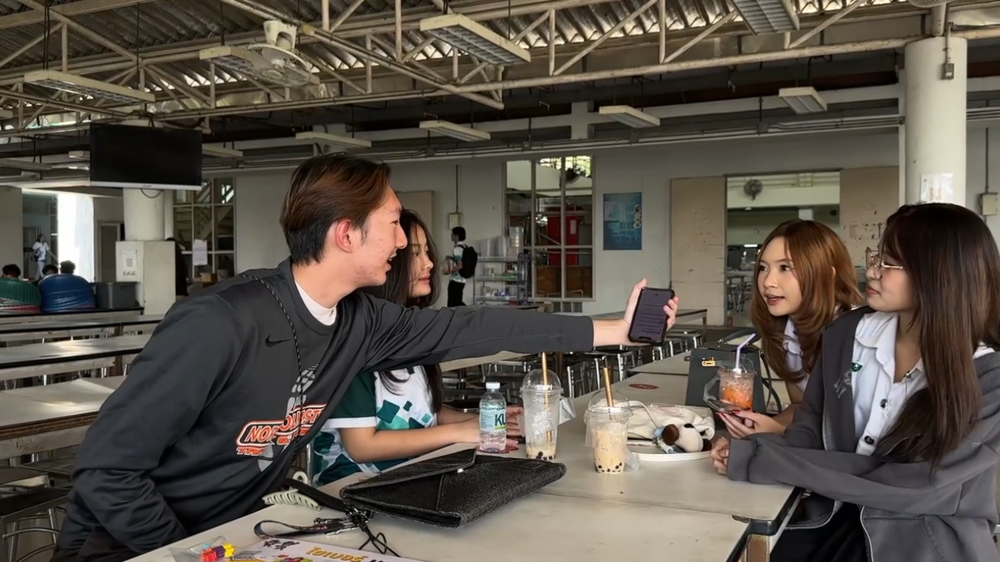
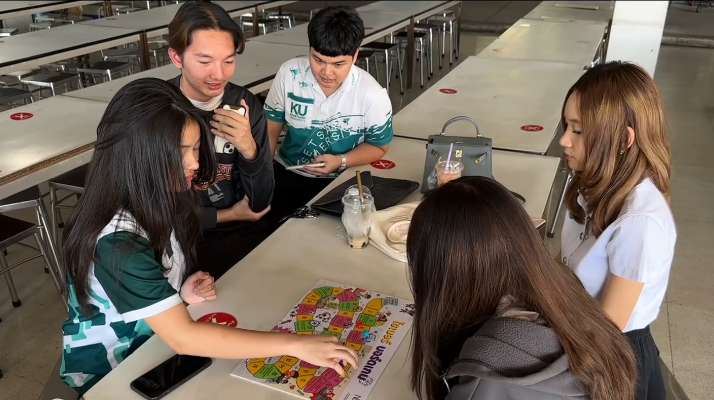
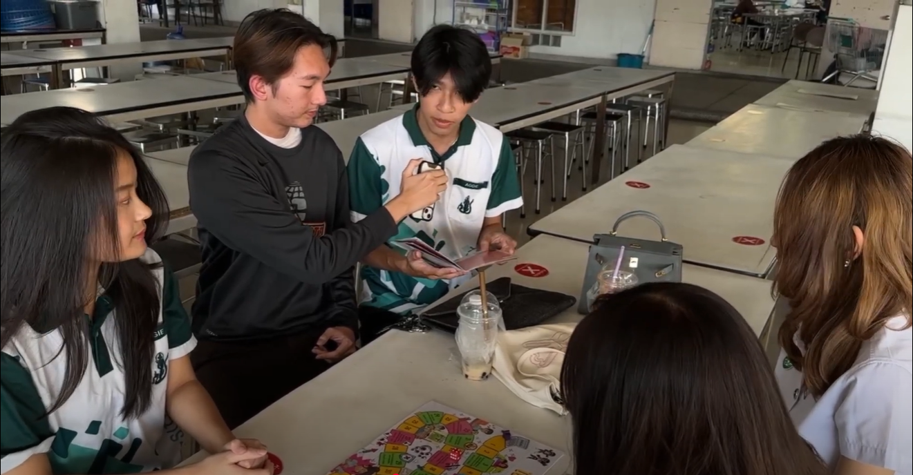

# Cyber Board Game
# By ก๊องV3

เมื่อวันที่ 7 มกราคม 2568 ณ โรงอาหาร มหาวิทยาลัยเกษตรศาสตร์ วิทยาเขตศรีราชา กลุ่มนิสิต “กลุ่มก๊อง V3” จากสาขาวิทยาการคอมพิวเตอร์ ได้จัดกิจกรรมด้วยการนำ “ไซเบอร์บอร์ดเกม” มาเป็นสื่อกลางในการส่งเสริมความรู้ความเข้าใจเกี่ยวกับความปลอดภัยในโลกไซเบอร์ให้นิสิตภายในมหาวิทยาลัย
กิจกรรมนี้ได้รับการสนับสนุนจากสำนักงานคณะกรรมการการรักษาความมั่นคงปลอดภัยไซเบอร์แห่งชาติ (สกมช.) โดยมีวัตถุประสงค์เพื่อให้ทุกคนตระหนักถึงภัยคุกคามที่เกิดขึ้นในโลกออนไลน์ และเรียนรู้วิธีการป้องกันตนเองจากภัยเหล่านั้น ผ่านการเล่นบอร์ดเกมที่ออกแบบมาให้ทั้งสนุกและได้ความรู้ โดยเฉพาะอย่างยิ่งในเรื่องของการจัดการข้อมูลส่วนตัวอย่างปลอดภัย

โดยภายในวันที่ 7 มกราคม 2568 กิจกรรมได้รับความสนใจจากนิสิตคณะวิทยาการจัดการ สาขาธุรกิจระหว่างประเทศ มาเข้าร่วม ซึ่งสะท้อนให้เห็นว่าปัญหาความปลอดภัยไซเบอร์เป็นเรื่องที่ทุกคนควรให้ความสำคัญ
กิจกรรมครั้งนี้จึงไม่เพียงแต่ให้ความสนุก แต่ยังมอบความรู้ความเข้าใจในการป้องกันภัยทางไซเบอร์ เพื่อให้ผู้เข้าร่วมกิจกรรมได้รับความรู้ไปปรับใช้เพื่อป้องกันภัยได้

# Member
[6530200525 นายสิทธิกร ประทุมวัน](https://6530200525.github.io/boardgame)

[6530200088 นายชลสิทธิ์ กิจกุลพิเชฐ](https://markchonlasit.github.io/chonlasitK.github.io/boardgame)

[6530200835 สรสิช ปัญญางค์](https://bossmahob.github.io/cyberboardgame)

[6530250395 ธนบดี บุญสุข](https://realalunda.github.io/cyberboardgame)

[6530250093 ธนพัฒน์ อุไรวงษ์](https://friday1313.github.io/cyberboardgame)
