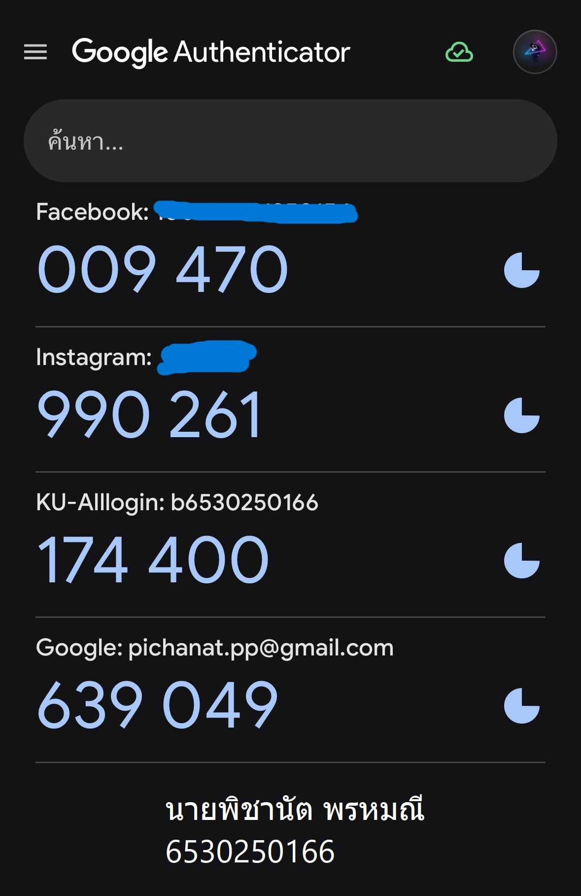

# Security-Control

# Google Authenticator (2FA)

- ✅**Control Function** : Preventative
- ✅**Type of SecurityControl** : Technical Control

<h3>เหตุผลที่จัดเป็น **Technical Control**</h3>
	
  - การใช้เทคโนโลยีในการยืนยันตัวตน: Google Authenticator ใช้เทคโนโลยีในการสร้างรหัส OTP ที่มีการเปลี่ยนแปลงทุกๆ 30 วินาที เพื่อยืนยันตัวตน

  - การเข้ารหัสข้อมูล: ข้อมูลที่ใช้ในการสร้าง OTP ถูกเข้ารหัสและจำกัดการเข้าถึงเพื่อความปลอดภัย

  - การป้องกันการแอบอ้าง: ระบบการยืนยันตัวตนที่ต้องการการเชื่อมต่อกับแอปพลิเคชันมือถือ ช่วยป้องกันการแอบอ้างตัวตนจากผู้ไม่ประสงค์ดี

<h3>เหตุผลที่เป็น **Preventative Control**</h3>
	
  - ป้องกันการเข้าถึงโดยไม่รับอนุญาต: โดยการใช้รหัส OTP ที่เปลี่ยนแปลงทุกครั้ง จะช่วยป้องกันการเข้าถึงบัญชีจากผู้ที่ไม่มีสิทธิ์

  - การเพิ่มความปลอดภัยล่วงหน้า: Google Authenticator ใช้เป็นมาตรการที่ช่วยป้องกันการเข้าถึงข้อมูลและบริการก่อนที่ผู้ไม่ประสงค์ดีจะพยายามเข้าถึง

  - การลดความเสี่ยงจากการโจรกรรมข้อมูล: ด้วยการใช้รหัส OTP และการยืนยันตัวตนสองขั้นตอน ช่วยลดความเสี่ยงที่ข้อมูลจะถูกโจรกรรมจากแหล่งที่ไม่ได้รับอนุญาต

<h1>นายธนบดี บุญสุข</h1>
